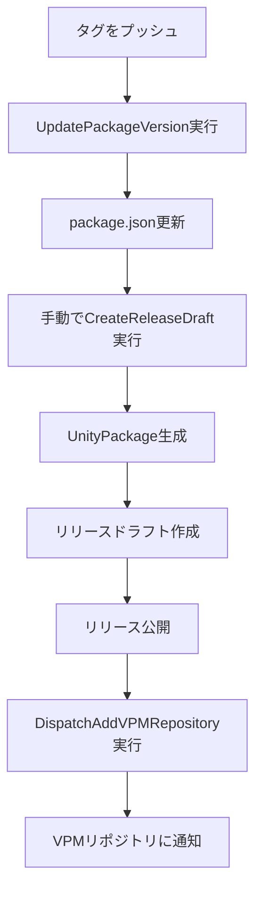

# VPM Unity Package Workflow

このリポジトリには、Unity Package Manager (VPM) 対応のUnityパッケージの自動リリース機能を提供するGitHubワークフローのテンプレートです。

複数のパッケージを一つのVPMリポジトリで管理・自動更新するため以下のリポジトリをフォークしたものが必要です。
[VPMRepositoryAutoUpdate](https://github.com/kurotori4423/VPMRepositoryAutoUpdate)

## 機能

### リリースドラフト自動生成機能


## 使い方

### 1. リポジトリの初期設定

このリポジトリから `Use this template` ボタンでリポジトリを作成します。

ワークフロー用の`Parsonal Access Token`が無い場合はGithubのユーザー設定から作成してください。
`Parsonal Access Token`は`Select Scopes`で`workflow`にチェックを入れてください。

作成したアクセストークンをリポジトリの`Settings` > `Secrets and variables` > `Actions` の `Repository secrets`に`VPM_REPO_TOKEN`として保存してください。

`Settings` > `Actions` > `General` > `Workflow permissions` で `Read and write permissions`に設定してください。

リポジトリをクローンして、`.github`フォルダをコピーします。

`DispatchAddVRMRepository.yml`で34行目の`repository: your-username/repository name`を`VPMRepositoryAutoUpdate`リポジトリの物に変更します。

### 2. VPMRepositoryAutoUpdateリポジトリ側での変更

[VPMRepositoryAutoUpdateのREADME](https://github.com/kurotori4423/VPMRepositoryAutoUpdate/blob/main/README.md#2-%E8%A8%AD%E5%AE%9A%E3%83%95%E3%82%A1%E3%82%A4%E3%83%AB%E3%81%AE%E7%B7%A8%E9%9B%86) を参考に、レポジトリの登録作業を行います。

### リリースの作成

[セマンティックバージョニング](https://semver.org/lang/ja/)(`v0.0.0`の形式)でバージョンをタグ付けして、プッシュします。

すると、自動で`Update Package Version from Tag`ワークフローが実行され、`package.json`のバージョン表記がタグで指定したバージョンに書き換えられ、リリースドラフトが作成されます。

リリースページで、リリースドラフトを確認し、パッチノートなどを描いたらリリースを公開します。

公開後、自動的に`Dispatch-Add-VPM-Repository`ワークフローが実行され、VPMリポジトリにパッケージが登録されます。

## 📋 ワークフローの概要

### 1. 🏷️ UpdatePackageVersion.yml
**タグベースでのpackage.jsonバージョン自動更新**

- **トリガー**: `v*` パターンのタグ（例：`v1.0.0`, `v2.1.3`）がプッシュされたとき
- **機能**:
  - タグからバージョン番号を抽出（`v`接頭辞を自動削除）
  - package.jsonの現在のバージョンと比較
  - 異なる場合のみpackage.jsonのversionフィールドを更新
  - 変更をコミットしてmainブランチにプッシュ

```bash
# 使用例
git tag v1.2.3
git push origin v1.2.3
# → package.jsonのversionが"1.2.3"に自動更新される
```

### 2. 📦 CreateReleaseDraft.yml
**UnityPackageとZipファイルのリリースドラフト自動作成**

- **トリガー**: 
  - `workflow_call` - 他のワークフローから呼び出し可能
  - `workflow_dispatch` - 手動実行可能
- **機能**:
  1. package.jsonから`displayName`と`version`を取得
  2. `.git`と`.github`フォルダを削除
  3. metaファイルリストを作成
  4. UnityPackageファイルを生成（`{displayName}_v{version}.unitypackage`）
  5. Zipアーカイブを作成（`{displayName}_v{version}.zip`）
  6. リリースドラフトを作成し、以下をアセットとして添付:
     - UnityPackageファイル
     - Zipファイル
     - package.json

### 3. 🚀 DispatchAddVPMRepository.yml
**VPMリポジトリへの自動通知**

- **トリガー**: リリースが公開されたとき（`published`）
- **機能**:
  - 外部のVPMリポジトリに新しいバージョンが公開されたことを通知
  - Repository Dispatchイベントを送信
- **VPMリポジトリテンプレート**: [VPMRepositoryAutoUpdate](https://github.com/kurotori4423/VPMRepositoryAutoUpdate)


## 🔄 ワークフローの流れ



## 📝 使用方法

### 1. 新しいバージョンをリリースする場合

```bash
# 1. バージョンタグを作成・プッシュ
git tag v1.2.3
git push origin v1.2.3

# 2. package.jsonが自動更新される

# 3. 手動またはワークフロー呼び出しでリリースドラフトを作成
# GitHubのActionsページから "Create Unity Package Release Draft" を実行

# 4. 作成されたドラフトリリースを確認・編集して公開
```

### 2. 手動でリリースドラフトを作成する場合

1. GitHubのActionsページを開く
2. "Create Unity Package Release Draft"を選択
3. "Run workflow"をクリック
4. 必要に応じてタグ名を指定して実行

## ⚠️ 注意事項

- package.jsonは必須です。存在しない場合、CreateReleaseDraftワークフローは失敗します
- `displayName`または`name`、`version`フィールドが必要です
- metaファイルが見つからない場合でも処理は続行されます
- VPMリポジトリへの通知にはappropriateな権限を持つトークンが必要です

## 🔧 カスタマイズ

各ワークフローは、プロジェクトの要件に応じてカスタマイズ可能です：
- ファイル名の形式変更
- 除外するファイル・フォルダの調整
- リリースノートの自動生成設定
- 通知先の変更

